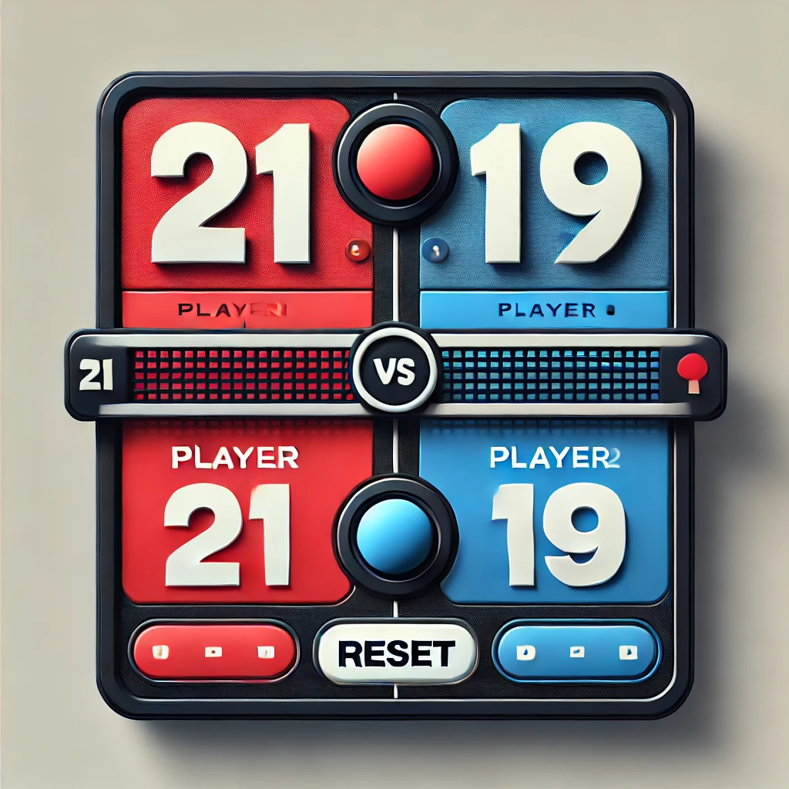

  

This is a dynamic web-based scoreboard application designed to track and display scores for two ping-pong players in real-time. Features include real-time score updates, customizable player names, match point settings, score history tracking with undo functionality, and visual alerts for game points and wins. Utilizes JavaScript for interactive elements and DOM manipulation to ensure a responsive and engaging user experience.
